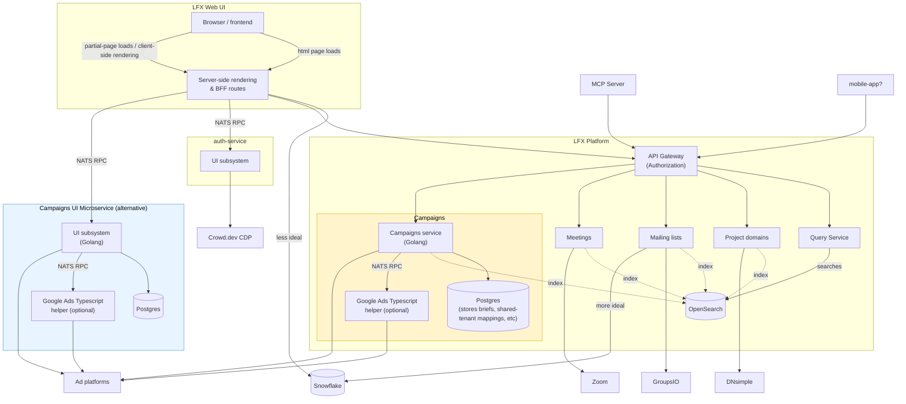
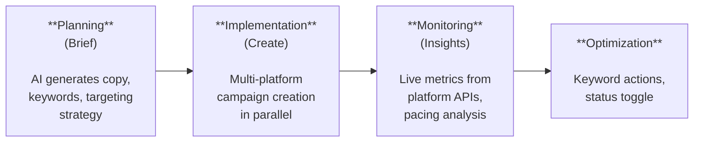
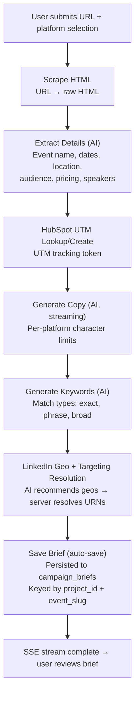
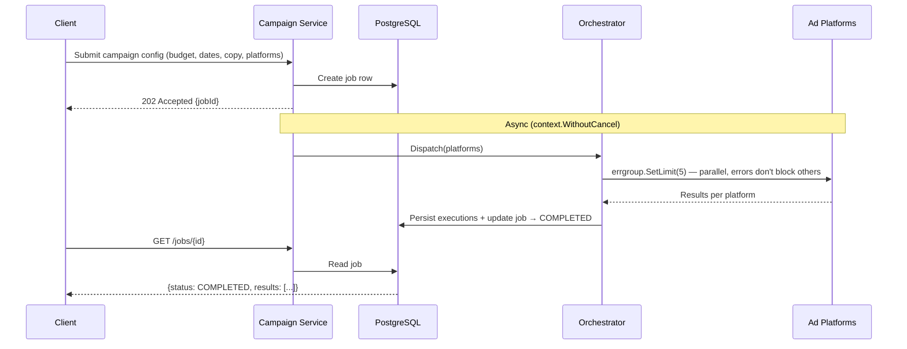
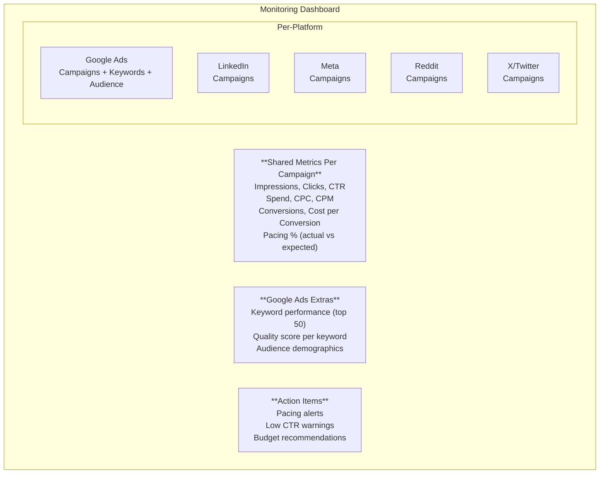
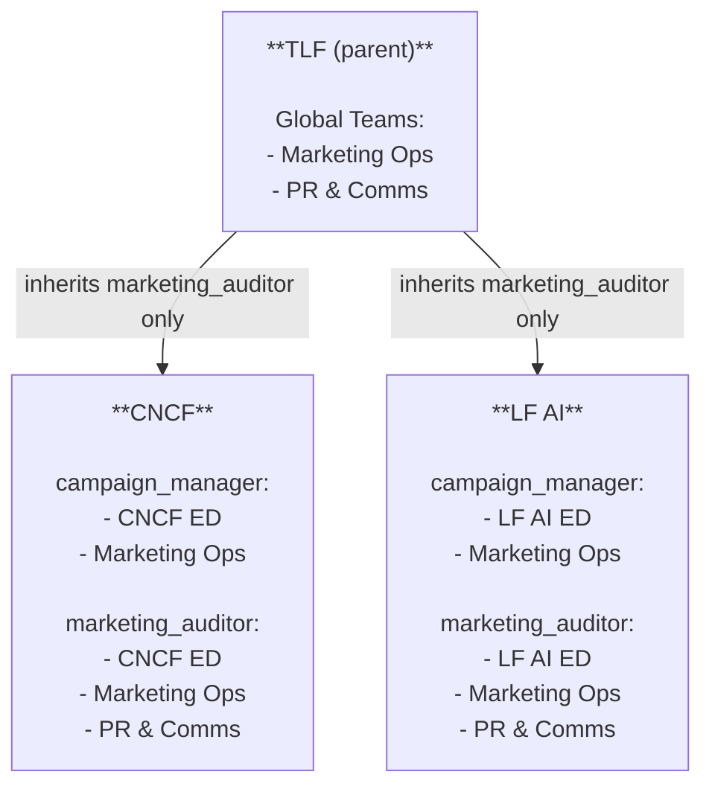
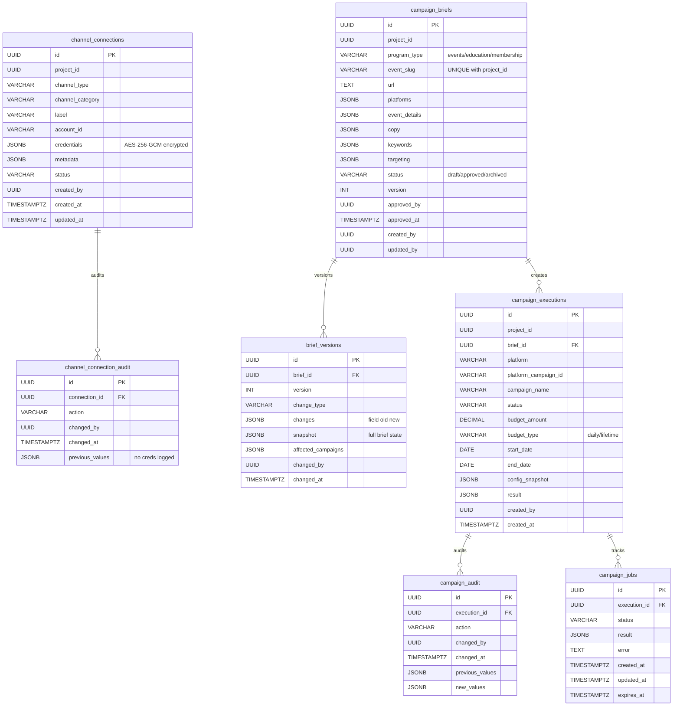
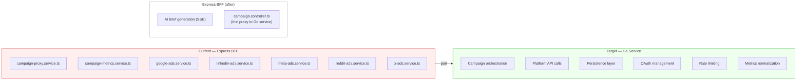

# Campaign Service — Architecture

## Overview

The Campaign Service is the backend for LFX Self Serve marketing campaign operations. It acts as a broker between the LFX UI and paid advertising platforms, owning both the upstream platform API calls and the persistence layer.

The service supports the full campaign lifecycle: multi-platform campaign creation, real-time monitoring, and optimization actions. AI-powered brief generation currently runs in the Express BFF and will migrate to this service in a later phase.

### User Personas

- **Marketing Operations** — cross-foundation access to create, monitor, and optimize campaigns across all ad platforms
- **Executive Directors** — foundation-scoped access to view campaign performance and marketing KPIs
- **PR & Communications** — read-only access to marketing KPIs across all projects (via `marketing_auditor` role)

## System Context

_Source: [Eric's marketing stack diagram](https://gist.github.com/emsearcy/6464a2b87ccb0b5d56c0d96bd1415c8c) (updated 2026-06-30)_

Two architecture options. **Orange** (API Gateway brokered) is preferred but requires adopting v2-Platform idioms (OpenFGA, Query Service). **Blue** (NATS RPC from SSR) de-risks by splitting into two phases: first the TypeScript → Go migration, then platform idiom adoption.



| | Orange (API Gateway brokered) | Blue (NATS RPC from SSR) |
|---|---|---|
| **Auth** | Heimdall / OpenFGA at API Gateway | UI-brokered (SSR passes auth context via NATS) |
| **Routing** | API Gateway → Campaigns service | SSR → NATS RPC → Campaigns UI subsystem |
| **Platform idioms** | Full: OpenFGA rules, Query Service, OpenSearch indexing | Deferred to phase 2 |
| **Risk** | Higher — must adopt platform auth + query patterns upfront | Lower — migration first, platform adoption second |
| **Recommendation** | Preferred (per Eric) | De-risks implementation |

## Campaign Lifecycle

The campaigns page has four tabs, each mapping to a phase of the campaign lifecycle:



### Phase 1: Planning (Brief Generation)

AI-powered campaign brief generation using SSE streaming.



**Character limits per platform:**

| Platform | Format |
|----------|--------|
| Google Search | Headlines (30ch x 15) + Descriptions (90ch x 4) |
| Google Display | Headlines (40ch x 5) + Descriptions (90ch x 5) |
| LinkedIn | Intro text (600ch) + Headline (200ch) |
| Meta | Primary (125ch) + Headline (40ch) + Description (30ch) |
| Reddit | Headline (300ch) + Body (500ch) |
| X/Twitter | Tweet text (280ch) |

**Brief Lifecycle:**
- **First visit:** new brief created (status: draft), `created_by` = current user
- **Return visit:** existing brief loaded, user can refresh or edit
- **Refresh:** re-runs AI generation, updates brief, bumps version
- **Edit:** manual edits saved as new version in `brief_versions` (what changed, who, when)
- **Approve:** brief reviewed and approved (status: approved), `approved_by` + `approved_at` recorded
- **Create:** approved brief used to create campaigns — each platform campaign saved as a `campaign_execution` linked to the brief
- **Update:** if campaigns already exist, edits UPDATE the existing campaigns on the platform (not create new ones). The `brief_version` records which campaigns were affected. Each change logged in `campaign_audit`.

**Create vs Update logic:**
- No `campaign_executions` for this brief? → CREATE new campaigns
- `campaign_executions` already exist? → UPDATE existing campaigns on the platform using `platform_campaign_id`, then update the execution record

**SSE Event Types:**
- `status` — progress messages
- `event` — extracted event/course details
- `hubspot_utm` — HubSpot UTM token
- `copy_token` — token-by-token AI output (streaming)
- `copy_done` — copy generation complete
- `copy_structured` — parsed, validated ad copy JSON
- `keywords` — keyword list
- `linkedin_strategy` — LinkedIn targeting recommendation
- `done` — stream complete

### Phase 2: Implementation (Campaign Creation)

Multi-platform campaign creation dispatched in parallel.



**Platform Creation Hierarchy:**

| Platform | Structure |
|----------|-----------|
| Google Ads (Search) | Budget -> Campaign -> Ad Group -> Keywords -> RSA Ad |
| Google Ads (Display) | Budget -> Campaign -> Ad Group -> Display Ad |
| LinkedIn | Campaign Group -> Campaign -> Dark Post -> Creative |
| Meta | Campaign -> Ad Set -> Ad |
| Reddit | Campaign -> Ad Group -> Promoted Post |
| X/Twitter | Campaign -> Line Item -> Promoted Tweet |

### Phase 3: Monitoring (Insights)

Live metrics fetched from platform APIs.



**Pacing Calculation:**
- Daily budget campaigns: `(actual spend) / (daily budget x days) x 100`
- Lifetime budget campaigns: `(actual spend) / ((elapsed days / total flight days) x total budget) x 100`

**Pacing Thresholds:**

| Label | Range |
|-------|-------|
| Underspending | < 50% |
| Normal | 50-90% |
| Constrained | 90-100% |
| Overspending | 100-130% |
| Severe | > 130% |

### Phase 4: Optimization

Actions to adjust running campaigns.

**Current:**
- **Keyword Management** (Google Ads) — bulk pause underperforming keywords, bulk remove irrelevant keywords
- **Campaign Status Toggle** (Meta, Reddit, X/Twitter) — ACTIVE ↔ PAUSED

**Tentative:**
- **Budget & Bidding** — adjust daily/lifetime budget, change bid strategy, update keyword bids
- **Ad Copy & Creative** — A/B test variants, update copy without recreating, rotate creatives
- **Targeting** — add/remove geo targets, update audience segments, negative keywords, bid modifiers
- **Scheduling** — ad scheduling / dayparting, extend/shorten flight dates
- **Cross-Platform** — bulk status toggle, reallocate budget across platforms based on performance

## Authorization Model



| Role | Access | Inheritance |
|------|--------|-------------|
| `campaign_manager` | Full CRUD on campaigns, connections, executions | ED + Marketing Ops. Does NOT inherit from parent. |
| `marketing_auditor` | Read-only access to marketing KPIs and campaign data | ED + Marketing Ops + PR & Comms. Inherits from parent for global team access. |

## What the Service Owns

1. **Platform connections** — CRUD for ad platform account credentials per project/foundation
2. **Upstream platform API calls** — campaign creation, status management, metrics retrieval
3. **Persistence** — campaign briefs, executions, job state, connection records
4. **Campaign orchestration** — multi-platform parallel dispatch, async job management
5. **Monitoring and analytics** — platform metrics fetch, normalization, pacing analysis, action items
6. **OAuth token management** — per-platform auth flows
7. **Rate limiting** — platform-specific write delays, retry logic (e.g. X/Twitter 1 req/sec)

## What the Service Does NOT Own

1. **AI brief generation** — stays in the UI Express layer (SSE streaming via LiteLLM). Eventually moves to this service.
2. **Authentication** — Heimdall at the gateway
3. **Authorization** — OpenFGA (`campaign_manager` and `marketing_auditor` relations)
4. **Frontend** — Angular components in lfx-v2-ui
5. **Snowflake marketing KPIs** — read from the data lake via query service, not from this service
6. **HubSpot UTM integration** — stays in the UI Express layer initially

## Persistence



**7 tables total:**
- `channel_connections` — all platform and channel connections (paid, email, organic, community)
- `channel_connection_audit` — audit trail for connection changes (no credentials logged)
- `campaign_briefs` — AI-generated campaign briefs, keyed by (project_id, event_slug). Tracks who created, last updated, and approved the brief. Must be approved before campaigns can be created from it.
- `brief_versions` — every edit to a brief saved as a version. Records what changed (budget, dates, copy, targeting), who changed it, when, and which campaigns were affected by the update. Full snapshot of the brief state at each version for auditability.
- `campaign_executions` — one row per platform campaign created or updated from a brief. Stores campaign name, platform, platform campaign ID, budget, dates, and who created it. If the brief is updated after campaigns exist, the existing campaigns are updated (not recreated) and the change is tracked in both `brief_versions` and `campaign_audit`.
- `campaign_audit` — audit trail for campaign changes. Logs every budget update, status change, date change, targeting change, and copy update with who made the change and the before/after values.
- `campaign_jobs` — async job queue for multi-platform dispatch

**Database:** Tofu-provisioned PostgreSQL for shared infrastructure. CloudNativePG for local development.

## Platform Connection Management

Campaign managers can create, read, update, and remove connections to ad platforms and channels for a given project. Each foundation may have separate credentials per platform. One project can have multiple connections of the same type (e.g., multiple Slack workspaces, multiple Discord servers).

### Account Tenancy

| Tenancy | Platforms | Details |
|---------|-----------|---------|
| Shared across foundations | Google Ads, HubSpot | One manager account, campaigns scoped by naming convention |
| Per-foundation | LinkedIn Ads, Meta Ads, Reddit, X/Twitter | Separate ad account per foundation |
| Per-project (multiple allowed) | Slack, Discord, Email lists, Social accounts | Multiple connections of the same type per project |

## Current Platform Accounts

Each platform has a different tenancy model. Some platforms use a single shared account across all foundations (campaigns separated by naming convention). Others have separate accounts per foundation/project, meaning each project connects to its own ad account.

**Single shared account:**

| Platform | Account | Notes |
|----------|---------|-------|
| Google Ads | Manager: 9746983954, Customer: 8666746580 | All foundations, distinguished by naming convention |
| HubSpot | Single private app token (org-wide) | Per-project brand kits, footers, templates |

**Separate accounts per foundation:**

| Platform | Foundation | Account |
|----------|-----------|---------|
| LinkedIn Ads | TLF | Account 538170226, Org 208777 |
| LinkedIn Ads | LF Events | Account 509430019 |
| Meta Ads | LF Core | Account act_193556282970417, Page 41911143546 |
| Reddit Ads | TLF | Account t2_gv9wtbfa |
| X/Twitter Ads | LF Events | Account 8r7gb (funding instrument pending) |

This distinction matters for the connection CRUD: Google Ads connections are typically one-per-org (shared), while LinkedIn/Meta connections are one-per-project (separate accounts). The `channel_connections` table supports both models.

## Future: Organic & Communication Channels

Beyond paid ad platforms, the campaign service will manage connections to organic channels for unified marketing operations. One project can have multiple channels of the same type (e.g., multiple Slack workspaces or Discord servers).

| Paid (current) | Email | Organic | Community |
|----------------|-------|---------|-----------|
| Google Ads | Email / HubSpot | LinkedIn Org | Slack (multiple per project) |
| LinkedIn Ads | (per-project brand kits, footers, templates) | Twitter/X Org | Discord (multiple per project) |
| Meta Ads | | Bluesky | |
| Reddit Ads | | Mastodon | |
| X/Twitter Ads | | YouTube | |
| Microsoft Ads | | | |

### Channel Connection Database Schema

All platform and channel connections stored in a single flexible schema. Credentials are encrypted at rest. One project can have many connections, and multiple connections of the same channel type.

```
+-------------------------------------------------------------------+
|                    channel_connections                              |
+-------------------------------------------------------------------+
| id                UUID        PK                                   |
| project_id        UUID        FK -> projects                       |
| channel_type      VARCHAR     'google-ads' | 'linkedin-ads' |      |
|                               'meta-ads' | 'reddit-ads' |          |
|                               'twitter-ads' | 'slack' |            |
|                               'discord' | 'email' |                |
|                               'linkedin-organic' |                  |
|                               'twitter-organic' |                   |
|                               'bluesky' | 'mastodon' |             |
|                               'youtube'                             |
| channel_category  VARCHAR     'paid' | 'email' | 'organic' |       |
|                               'community'                          |
| label             VARCHAR     Human-readable name                  |
|                               e.g. "CNCF LinkedIn", "#kubecon-na"  |
| account_id        VARCHAR     Platform account identifier          |
| credentials       JSONB       Encrypted credential blob            |
|                               (see per-channel schema below)       |
| metadata          JSONB       Non-secret config                    |
|                               (org ID, page ID, server name, etc.) |
| status            VARCHAR     'active' | 'inactive' |             |
|                               'error' | 'deleted'                  |
| created_by        UUID        User who created the connection      |
| created_at        TIMESTAMPTZ                                      |
| updated_at        TIMESTAMPTZ                                      |
+-------------------------------------------------------------------+
  Indexes:
    - (project_id, channel_type)   -- list all connections of a type
    - (project_id, status)         -- list active connections
    - (channel_type, account_id)   -- supports lookup (not unique; multiple connections per project allowed)

+-------------------------------------------------------------------+
|                    channel_connection_audit                         |
+-------------------------------------------------------------------+
| id                UUID        PK                                   |
| connection_id     UUID        FK -> channel_connections             |
| action            VARCHAR     'created' | 'updated' | 'deleted' |  |
|                               'credentials_rotated' |              |
|                               'status_changed'                     |
| changed_by        UUID        User who made the change             |
| changed_at        TIMESTAMPTZ                                      |
| previous_values   JSONB       Snapshot of changed fields (no creds)|
+-------------------------------------------------------------------+
```

### Credential Storage Per Channel Type

The `credentials` JSONB column stores encrypted, channel-specific secrets. The `metadata` column stores non-secret configuration.

**Paid Ad Platforms:**

| Channel | credentials (encrypted) | metadata |
|---------|------------------------|----------|
| `google-ads` | `{ refresh_token, client_id, client_secret, developer_token }` | `{ customer_id, login_customer_id }` |
| `linkedin-ads` | `{ access_token }` | `{ ad_account_id, org_id }` |
| `meta-ads` | `{ access_token, app_secret }` | `{ ad_account_id, page_id, app_id }` |
| `reddit-ads` | `{ client_id, client_secret, refresh_token }` | `{ ad_account_id }` |
| `twitter-ads` | `{ consumer_key, consumer_secret, access_token, access_token_secret }` | `{ account_id, funding_instrument_id }` |

**Email:**

| Channel | credentials (encrypted) | metadata |
|---------|------------------------|----------|
| `email` | `{ private_app_token }` | `{ portal_id, list_ids[], sender_email, brand_kit }` |

Each project has its own brand kit, footer, and email templates, selected based on the request.

**Organic Social:**

| Channel | credentials (encrypted) | metadata |
|---------|------------------------|----------|
| `linkedin-organic` | `{ access_token }` | `{ org_id, org_name }` |
| `twitter-organic` | `{ consumer_key, consumer_secret, access_token, access_token_secret, bearer_token }` | `{ username, user_id }` |
| `bluesky` | `{ app_password }` | `{ handle, did }` |
| `mastodon` | `{ access_token }` | `{ instance_url, username }` |
| `youtube` | `{ refresh_token, client_id, client_secret }` | `{ channel_id, channel_name }` |

**Community (Slack / Discord):**

| Channel | credentials (encrypted) | metadata |
|---------|------------------------|----------|
| `slack` | `{ bot_token, signing_secret }` | `{ workspace_id, workspace_name, channel_ids[] }` |
| `discord` | `{ bot_token }` | `{ server_id, server_name, channel_ids[] }` |

### One Project, Many Channels

```
Project: CNCF
+-------------------------------------------------------------------+
| channel_connections                                                |
|-------------------------------------------------------------------|
| google-ads    | Customer 8666746580          | active   | paid    |
| linkedin-ads  | Account 538170226 (TLF)     | active   | paid    |
| linkedin-ads  | Account 509430019 (Events)  | active   | paid    |
| meta-ads      | Account act_19355...        | active   | paid    |
| email         | HubSpot list "CNCF News"    | active   | email   |
| email         | HubSpot list "KubeCon"      | active   | email   |
| slack         | #cncf-marketing             | active   | community|
| slack         | #kubecon-na-2025            | active   | community|
| slack         | #kubecon-eu-2025            | active   | community|
| discord       | CNCF Community Server       | active   | community|
| discord       | Kubernetes Server           | active   | community|
| bluesky       | @cncf.io                    | active   | organic |
| mastodon      | @cncf@fosstodon.org         | active   | organic |
| linkedin-organic | CNCF org page            | active   | organic |
| twitter-organic  | @CloudNativeFdn          | active   | organic |
| youtube       | CNCF channel                | active   | organic |
+-------------------------------------------------------------------+
```

## Supported Platforms

| Platform | Auth | API Style | Key Details |
|----------|------|-----------|-------------|
| Google Ads | OAuth 2.0 | gRPC | Budget in micros (divide by 1M), no GAQL date fields in v23+ |
| LinkedIn Ads | OAuth 2.0 | REST (v202602) | Targeting profiles (skills + groups), geo URN resolution, `feedDistribution: NONE` for dark posts |
| Meta Ads | Bearer token | REST (Graph API) | ISO geo codes, objective-to-parameter mapping |
| Reddit Ads | OAuth 2.0 | REST | Token refresh with expiry buffer, subreddit targeting |
| X/Twitter Ads | OAuth 1.0a (HMAC-SHA1) | REST (v12) | 1 req/sec write rate limit, exponential backoff retry |
| HubSpot | Bearer token (private app) | REST | UTM campaign lookup/create for tracking |

## Campaign-to-Project Mapping

Campaign attribution to projects is based on the campaign naming convention:

```
Program | Event Name | Region | Objective | Targeting | Ad Format | Project | Funnel | Date

Example:
Events | KubeCon NA 2025 | EMEA | Conversions | Intent | Search | CNCF | MoFU | 2025-06-01
```

The data pipeline parses campaign names to attribute them to the correct foundation/project. No manual mapping entry needed once the naming convention is followed.

## Migration Path

The existing campaign code lives in three layers in the Angular monorepo:



### Phase 1: Scaffold + Persistence (ships first)

Go service scaffold, database schema, repository layer. Solves the data loss problem (in-memory job map, briefs lost between sessions, state breaks across 3 replicas).

### Phase 2: Port Platform Services (one PR per platform)

Each platform ported independently. Express controller becomes thin proxy. Old TypeScript service removed per platform.

### Phase 3: Orchestration + Metrics

Campaign orchestration, multi-platform dispatch, metrics normalization moved to Go.

### Phase 4: Deployment + Cutover

Helm chart, httproute, ruleset, environment config. Express routes proxy to Go service.

## Known Limitations and Gotchas

1. **Multi-replica state loss** — current in-memory job map loses state across replicas. Persistence layer fixes this.
2. **Google Ads Go SDK gap** — no official Go client library. Need raw gRPC proto compilation or REST fallback.
3. **SSE streaming boundary** — AI brief generation stays in Express. Brief result crosses service boundary after stream completes.
4. **Platform API quirks** — LinkedIn `feedDistribution: NONE`, Reddit token expiry race, X 1 req/sec write limit. All encoded in current TypeScript and must be preserved in Go port.
5. **Campaign naming collision** — Google Ads fails on duplicate names. Retry adds timestamp suffix.
6. **Demand Gen geo targeting** — Google Demand Gen doesn't support campaign-level geo; applied at ad group level.
