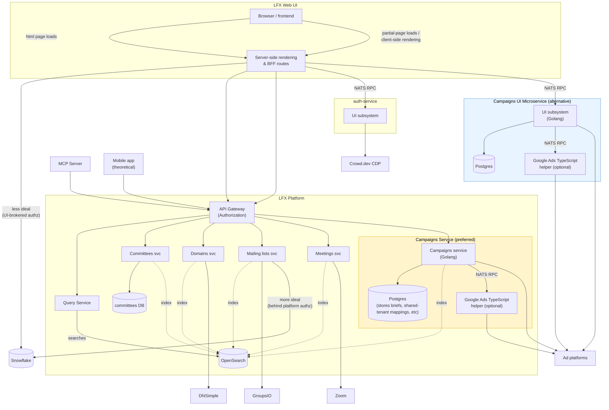
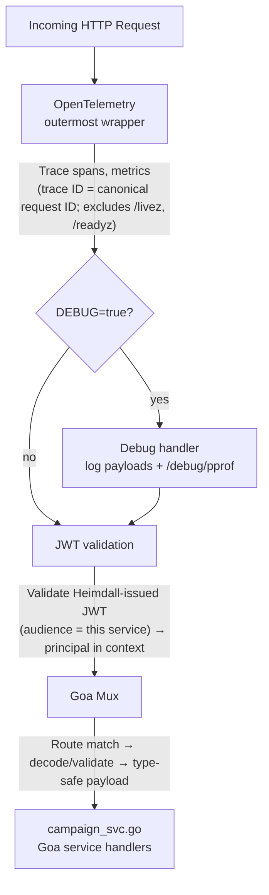
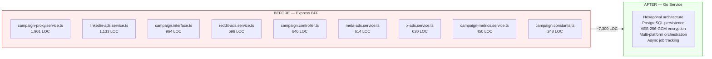
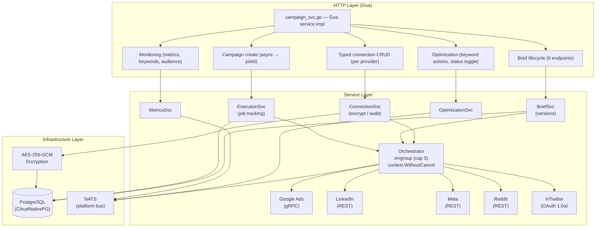
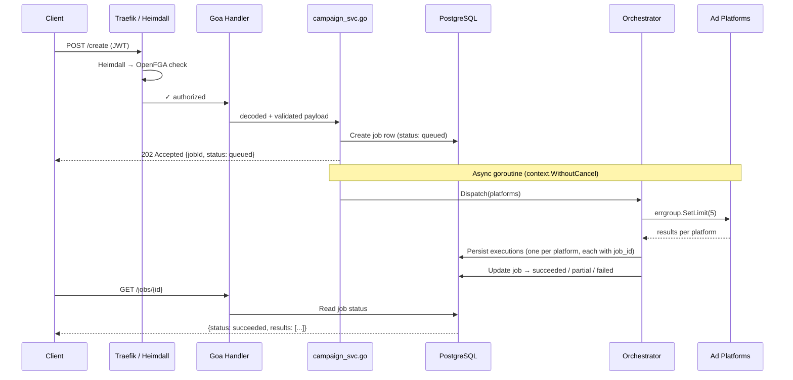
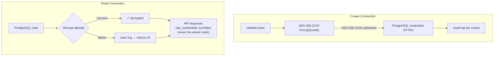

# Campaign Service — Build Summary

**Status:** Architecture Review — Aligning with platform patterns  
**Date:** 2026-06-30  
**References:** [committee-service](https://github.com/linuxfoundation/lfx-v2-committee-service), [lfx-v2-helm](https://github.com/linuxfoundation/lfx-v2-helm), [Eric's gist](https://gist.github.com/emsearcy/6464a2b87ccb0b5d56c0d96bd1415c8c)

---

## Target Architecture

_Source: [Eric's marketing stack diagram](https://gist.github.com/emsearcy/6464a2b87ccb0b5d56c0d96bd1415c8c) (updated 2026-06-30)_

Campaigns integrates as an **API Gateway-brokered platform service** (orange in the diagram below) — behind the API Gateway with Heimdall/OpenFGA authorization and the Query Service for reads/indexing. The blue NATS-RPC-from-SSR shape is retained in the diagram for context only and is not the chosen architecture.



### Option comparison

| | Orange (API Gateway brokered) | Blue (NATS RPC from SSR) |
|---|---|---|
| **Auth** | Heimdall / OpenFGA at API Gateway | UI-brokered (SSR passes auth context via NATS) |
| **Routing** | API Gateway → Campaigns service | SSR → NATS RPC → Campaigns UI subsystem |
| **Platform idioms** | Full: OpenFGA rules, Query Service, OpenSearch indexing | Deferred to phase 2 |
| **Risk** | Higher — must adopt platform auth + query patterns upfront | Lower — migration first, platform adoption second |
| **Recommendation** | Preferred (per Eric) | De-risks implementation |

---

## Middleware Pipeline

_Reference: [committee-service/cmd/committee-api/http.go](https://github.com/linuxfoundation/lfx-v2-committee-service)_



**JWT is validated in-app.** This service does *not* validate the user's original API access token — but it **does** validate the Heimdall-issued JWT whose audience is this backend microservice, extracting the principal into the request context. That validation step lives in this service, not upstream.

**Request ID:** no separate request-ID middleware. The **OTEL trace ID is the canonical request identifier** and is what is emitted in logs, so log lines align with traces. (Other services carry an `X-Request-ID`, but that is redundant with the trace ID.)

**Not in-app (handled upstream):**

| Concern | Handled by | Notes |
|---------|-----------|-------|
| CORS | — (not applicable) | Not needed: this is not an SPA. API requests are made by the SSR backend (server-to-server), so the browser never calls this service cross-origin. Any CORS concerns are confined to the web app's own frontend→Express partial-page updates (response headers set by that Express layer) — CORS is not a concern of this service and is not "handled by Traefik". |
| Authorization (ReBAC) | Heimdall → OpenFGA | This service defines its **own** RuleSets (referencing the marketing relations on `project`). There is no per-service `*/heimdall-middleware.yaml` resource — routes reference a shared middleware; each service supplies its rulesets. |
| Panic recovery | Go `http.Server` default | Not in committee-service |

Health probes `/livez` and `/readyz` bypass the middleware chain.

---

## What We're Porting

Migrating **~7,300 lines of TypeScript** (Express BFF) → **Go microservice**.



**Problems solved:** in-memory job map (3 replicas = lost state), no persistence, no credential encryption, no audit trail.

---

## Campaign Service Architecture



**Why PostgreSQL:** campaigns needs relational queries and secondary-index lookups across briefs, executions, and per-provider connections (lookups on more than a primary key). NATS KV does not scale to that — committee-service is itself moving off NATS KV for the same reason (maintaining secondary indexes for non-primary-key lookups). Note that credential encryption is not itself an argument for one backend over another: because credentials are encrypted at the application layer *before* storage, they would be equally opaque in any store. NATS remains in use for events, inter-service comms, index updates → OpenSearch, and FGA sync → OpenFGA.

**Auth:** ReBAC (OpenFGA relations) is evaluated upstream at the gateway via Heimdall; CORS does not apply (this is not an SPA — see the middleware section). The **Heimdall-issued JWT is validated in this service** (audience = this microservice).

---

## File Structure (proposed, aligned with committee-service)

_Reference: [lfx-v2-committee-service](https://github.com/linuxfoundation/lfx-v2-committee-service) directory layout_

```
lfx-v2-campaign-service/
├── cmd/campaign-api/                    — follows committee-api pattern
│   ├── main.go                          — entry point + startup orchestration
│   ├── http.go                          — HTTP server + middleware chain
│   ├── design/                          — Goa design DSL (co-located, not top-level)
│   │   ├── design.go                    — API definition, auth, errors
│   │   ├── types.go                     — shared Goa types
│   │   ├── connections.go               — typed connection CRUD (per provider)
│   │   ├── briefs.go                    — brief lifecycle (6 endpoints)
│   │   ├── campaigns.go                 — create + job tracking
│   │   ├── monitoring.go                — metrics endpoints
│   │   └── optimization.go             — keyword actions, status toggle
│   └── service/                         — Goa service handlers + providers
│       ├── campaign_svc.go              — Goa service implementation
│       └── providers.go                 — sync.Once singletons for DI
│
├── internal/
│   ├── domain/
│   │   ├── model/                       — ChannelConnection, CampaignBrief, Execution, Job
│   │   └── port/                        — Reader/Writer/Auditor interfaces
│   ├── service/                         — connection, brief, execution, orchestrator, metrics, optimization
│   ├── platform/
│   │   ├── platform.go                  — PlatformClient interface
│   │   ├── googleads/                   — gRPC campaign creation + GAQL metrics
│   │   ├── linkedin/                    — REST + targeting profiles
│   │   ├── meta/                        — Graph API
│   │   ├── reddit/                      — REST + token refresh
│   │   ├── twitter/                     — OAuth 1.0a HMAC-SHA1
│   │   └── hubspot/                     — UTM campaign lookup/create
│   ├── infrastructure/
│   │   ├── config/config.go
│   │   ├── crypto/aes.go               — AES-256-GCM encrypt/decrypt
│   │   ├── nats/                        — pub/sub, request/reply
│   │   └── postgres/                    — pool, migrations, repositories
│   └── middleware/
│       └── jwt.go                       — validate Heimdall-issued JWT (audience = this service)
│
├── gen/                                 — Goa-generated (committed per platform convention)
├── pkg/constants/                       — platforms, char limits, targeting, campaign naming
├── charts/lfx-v2-campaign-service/      — Helm chart (Gateway API, Heimdall)
└── docs/
```

**Key differences from committee-service:**

| Aspect | committee-service | campaign-service | Why |
|--------|------------------|------------------|-----|
| Primary store | NATS KV | PostgreSQL | Credentials require encryption + relational queries |
| External APIs | None | 5 ad platforms + HubSpot | Core purpose is ad platform orchestration |
| NATS usage | Primary data store | Events + inter-service | Index updates, FGA sync, cross-service queries |

---

## Key Design Decisions

| Decision | Why |
|----------|-----|
| Broker pattern (not stateful store) | Go owns platform APIs + persistence. Per Eric/Jordan (2026-06-24). |
| PostgreSQL + NATS (not NATS KV only) | PG for relational data (credentials, briefs, executions). NATS for events + inter-service. Campaigns needs PG for AES-256-GCM encrypted creds. |
| AES-256-GCM | Credentials encrypted at rest. Never returned in API responses. Backwards-compatible passthrough. |
| ReBAC upstream, JWT validated in-app | ReBAC (OpenFGA) evaluated at the gateway via Heimdall; the Heimdall-issued JWT (audience = this service) is validated in-app. CORS N/A (not an SPA). |
| Typed per-provider persistence | One table per provider (`google_ads_connections`, …), not a generic `channel_connections` + untyped `metadata`. Credentials/config differ per provider; strong typing is a clearer contract. |
| `version` iterator + ETag/If-Match | Every resource table carries `version BIGINT`; PUTs require `If-Match`. Optimistic-locking per 2026-05-CloudNativePG. |
| Reads/lists/history via Query Service | No bespoke list or audit endpoints; the Query Service serves lists and revision history from indexed resources. |
| Hexagonal architecture | domain → ports → adapters. Easy to swap DB or add platforms. |
| Per-provider typed tables + app encryption | One table per provider with first-class credential/config columns; credentials app-encrypted (AES-256-GCM) with a key from a k8s secret. |
| errgroup (cap 5) | Bounded concurrency for multi-platform dispatch. Won't overwhelm APIs. |
| context.WithoutCancel | Async goroutines survive request cancellation (Go 1.21+). |
| Google Ads TS helper (optional) | gRPC client complexity may warrant keeping TypeScript sidecar, connected via NATS RPC. |

---

## Request Flow: Campaign Creation



---

## Data Flow: Credential Security



---

## Migration Map: TypeScript → Go

| TypeScript Source | Lines | Go Target | PR |
|------------------|-------|-----------|-----|
| `campaign.interface.ts` | 964 | `design/types.go` + `internal/domain/model/*.go` | 1, 2, 5 |
| `campaign.constants.ts` | 248 | `pkg/constants/*.go` | 4 |
| `campaign.controller.ts` | 646 | `design/*.go` (Goa) + `campaign_svc.go` | 1, 6, 7, 14, 15 |
| `campaign-proxy.service.ts` | 1,901 | `orchestrator.go` + `brief_service.go` | 6, 7, 13 |
| `linkedin-ads.service.ts` | 1,133 | `internal/platform/linkedin/*.go` | 9 |
| `meta-ads.service.ts` | 614 | `internal/platform/meta/*.go` | 10 |
| `reddit-ads.service.ts` | 698 | `internal/platform/reddit/*.go` | 11 |
| `x-ads.service.ts` | 620 | `internal/platform/twitter/*.go` | 12 |
| `campaign-metrics.service.ts` | 450 | `internal/service/metrics_service.go` | 14 |
| Google Ads (in proxy) | ~600 | `internal/platform/googleads/*.go` | 8A, 8B |

---

## Blockers

| Blocker | Impact | Owner | Status |
|---------|--------|-------|--------|
| Architecture alignment | Must match committee-service patterns | Misha + Eric | In progress — Eric reviewing |
| PR #2 arch doc update | Updated diagram needed before code PRs | Misha | This document |
| PostgreSQL provisioning | Can't run migrations in cluster | David (requested) | Pending |
| Antonia — Backstage template | CI fails on main | Antonia + David | In progress |

---

## Next Steps

### Immediate (from architecture review meeting)

1. Update PR #2 with this aligned architecture document
2. Eric reviews and provides line-by-line feedback on the diagram
3. Restructure repo to match committee-service layout:
   - Move `design/` → `cmd/campaign-api/design/`
   - Move `campaign_svc.go` → `cmd/campaign-api/service/`
   - Add `providers.go` with `sync.Once` pattern
   - Rename `server.go` → `http.go`
   - Remove in-app CORS middleware (CORS is not applicable — not an SPA)
   - Keep in-app JWT validation of the Heimdall-issued JWT (audience = this service)
   - Drop the request-ID middleware; use the OTEL trace ID as the canonical request ID in logs
   - Add NATS client for platform bus integration
   - Define this service's own Heimdall RuleSets (no per-service `heimdall-middleware.yaml`)

### After alignment approval

1. Split into **~10 PRs** (each under 1,000 lines), submit sequentially
2. PR 1: Fix build + Goa design (aligned structure)
3. PR 2: Domain models + PostgreSQL migrations
4. PR 3: Connection service + DI wiring
5. PRs 4-10: Platform clients, orchestration, monitoring, optimization
